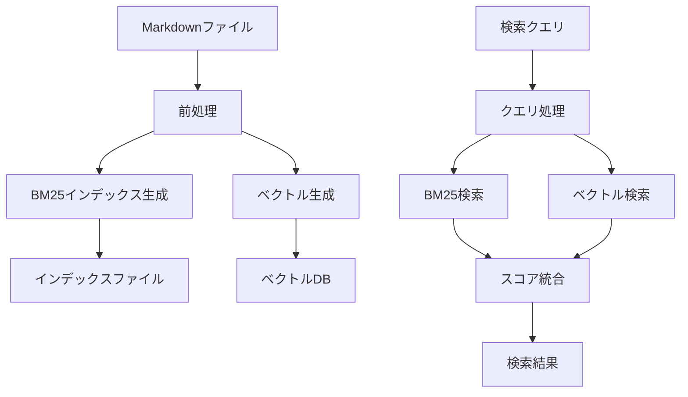

# ドキュメント検索機能要件

## 概要

React Router v7 および Remix の日本語ドキュメントサイトにおける高度な検索機能の実装要件。BM25アルゴリズムによる全文検索とベクトル検索を組み合わせたハイブリッド検索により、より精度の高い検索体験を提供する。

## 背景

現在のPagefind実装から、以下の理由でハイブリッド検索への移行を計画：
- **意味的な検索**: ベクトル検索により、キーワードが完全一致しなくても関連する内容を発見可能
- **検索精度の向上**: BM25による伝統的な全文検索とベクトル検索の組み合わせで最適な結果を提供
- **将来の拡張性**: Remote MCP Server との統合を見据えた設計

## 機能要件

### 1. インデックス生成

#### 1.1 BM25インデックス

- **対象**: `/docs` ディレクトリ内のすべてのMarkdownファイル
- **前処理**:
  - 日本語形態素解析（MeCab/kuromoji等）
  - ストップワード除去
  - 正規化処理
- **メタデータ**: タイトル、パス、セクション情報

#### 1.2 ベクトルインデックス

- **エンベディングモデル**:
  - Google Gemini Embedding (`gemini-embedding-exp-03-07`)
  - AI SDK (`@ai-sdk/google`) を使用
  - 事前にビルド時にエンベディングを生成
- **チャンク戦略**:
  - セクション単位での分割
  - オーバーラップ付き固定長チャンク（512-1024トークン）
- **ベクトル検索方式**:
  - ブラウザ上でのオンメモリ検索
  - 事前計算したベクトルを静的JSONファイルとして配信
  - コサイン類似度による全探索（小規模データセットに最適）
- **次元数**: Geminiモデルの出力次元に準拠

### 2. 検索API

#### 2.1 エンドポイント

```typescript
// app/routes/api.search.ts
interface SearchRequest {
  query: string
  limit?: number
  filters?: {
    section?: string[]
    type?: string[]
  }
}

interface SearchResult {
  id: string
  title: string
  path: string
  excerpt: string
  score: {
    bm25: number
    vector: number
    combined: number
  }
  highlights: string[]
}
```

#### 2.2 ハイブリッドスコアリング

- BM25スコアとベクトル類似度の重み付き組み合わせ
- 初期重み: BM25 (0.6) + Vector (0.4)
- 将来的に機械学習による重み最適化

### 3. 検索UI

- **既存UIの活用**: 現在のモーダルダイアログUIを維持
- **追加機能**:
  - 検索結果のスコア表示（デバッグモード）
  - セクション別フィルタリング
  - 関連ドキュメントの提案

### 4. パフォーマンス要件

- **初回検索**: 500ms以内
- **後続検索**: 200ms以内
- **インデックスサイズ**:
  - BM25: 元のコンテンツサイズの20%以下
  - ベクトル: Geminiモデルの次元数に依存

## 技術仕様

### アーキテクチャ



### 実装フェーズ

#### Phase 1: 基盤構築

1. BM25検索の実装
   - 日本語トークナイザーの統合
   - インデックス生成スクリプト
   - 検索APIの実装

#### Phase 2: ベクトル検索追加

1. エンベディングモデルの選定と統合
2. ベクトルインデックス生成
3. ハイブリッド検索の実装

#### Phase 3: 最適化

1. インデックスの圧縮・最適化
2. キャッシング戦略
3. 検索品質の評価と改善

### ディレクトリ構造

```bash
public/search-index/
├── bm25/
│   ├── index.json         # BM25インデックス
│   └── metadata.json      # ドキュメントメタデータ
├── vectors/
│   ├── embeddings.json    # ベクトルデータ（JSON形式）
│   └── chunks.json        # チャンク分割されたドキュメント
└── config.json            # 検索設定
```

### 依存関係

```json
{
  "dependencies": {
    "@ai-sdk/google": "最新版",
    "ai": "最新版",
    "kuromoji": "日本語形態素解析"
  },
  "devDependencies": {
    "@ai-sdk/google": "ビルド時のエンベディング生成用"
  }
}
```

### エンベディング生成例

```typescript
// ビルド時（Node.js環境）
import { google } from '@ai-sdk/google';

const model = google.textEmbeddingModel('gemini-embedding-exp-03-07');

// ビルド時にエンベディングを生成
const { embedding } = await model.embed({
  value: chunkText,
});

// 静的ファイルとして保存
const vectorData = {
  id: documentId,
  vector: embedding,
  metadata: { title, path, section }
};
```

### ブラウザでのベクトル検索実装

```typescript
// ブラウザ実行時
function cosineSimilarity(a: number[], b: number[]): number {
  let dotProduct = 0;
  let normA = 0;
  let normB = 0;
  
  for (let i = 0; i < a.length; i++) {
    dotProduct += a[i] * b[i];
    normA += a[i] * a[i];
    normB += b[i] * b[i];
  }
  
  return dotProduct / (Math.sqrt(normA) * Math.sqrt(normB));
}

// 検索実行
async function vectorSearch(queryVector: number[], vectors: VectorData[]) {
  const results = vectors.map(item => ({
    ...item,
    score: cosineSimilarity(queryVector, item.vector)
  }));
  
  return results.sort((a, b) => b.score - a.score);
}
```

## データフロー

### ビルド時

```text
Markdown → 前処理 → トークン化 → BM25インデックス
                 ↓
            チャンク分割 → エンベディング → ベクトルインデックス
```

### 実行時

```text
検索クエリ → クエリ拡張 → BM25検索 → スコア
                      ↓              ↓
                 エンベディング → ベクトル検索 → 統合 → 結果
```

## 将来の拡張: Remote MCP Server

### MCP Server概要

検索機能をMCP (Model Context Protocol) サーバーとして公開し、外部のAIアシスタントから利用可能にする。

### 想定される機能

- ドキュメント検索API
- コンテキスト取得API
- 関連ドキュメントの推薦

### 実装イメージ

```typescript
// apps/mcp-server/src/index.ts
interface MCPSearchTool {
  name: "search_docs"
  description: "Search React Router/Remix Japanese documentation"
  parameters: {
    query: string
    context?: string
    limit?: number
  }
}
```

## セキュリティ・プライバシー

- クライアントサイド検索の維持（プライバシー保護）
- エンベディングは事前計算（APIキー不要）
- 静的配信可能な設計

## 成功指標

- 検索精度: 関連ドキュメントの上位5件ヒット率 90%以上
- パフォーマンス: 95パーセンタイル応答時間 300ms以下
- ユーザビリティ: 既存UIとの互換性維持

## 参考資料

- [BM25アルゴリズム](https://en.wikipedia.org/wiki/Okapi_BM25)
- [Model Context Protocol](https://modelcontextprotocol.io/)
- 現在の実装: `/packages/scripts/src/build-index.ts`
